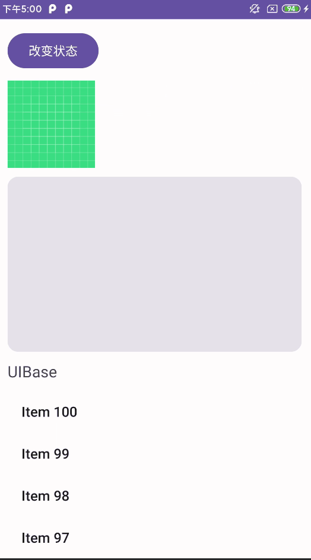
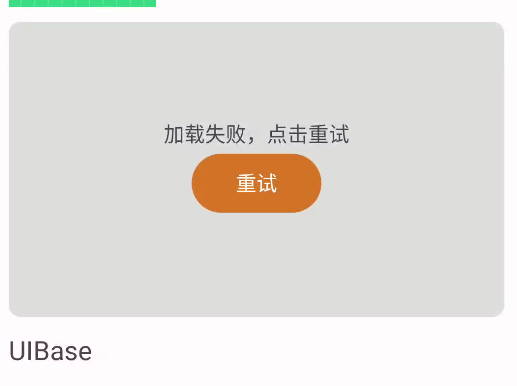
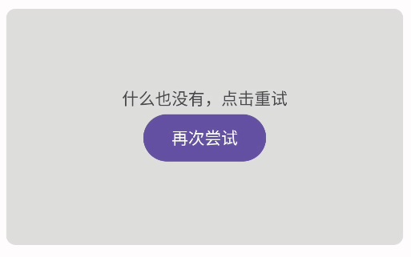
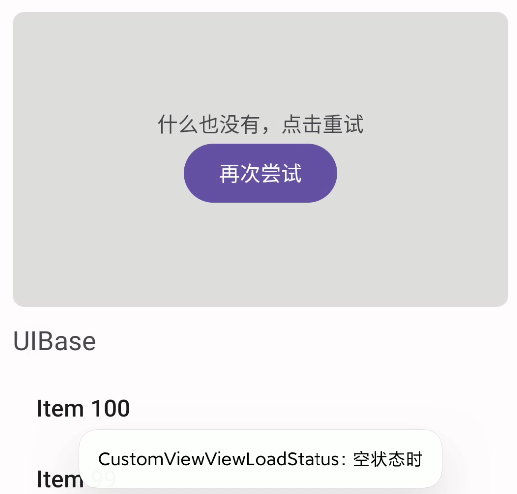

# ViewLoadStatus：更好的管理View 状态

[](https://jitpack.io/#GituioPyeb/custom-view-view-load-status)

## 使用依赖方式导入
**步骤一：在项目根目录下的`build.gradle`添加**
```
maven { url 'https://jitpack.io' }
```
**步骤二：添加依赖**
```
implementation 'com.github.GituioPyeb:custom-view-view-load-status:0.2-TEST'
```
## 支持的布局及控件
**父布局**
- 支持 ConstraintLayout 父布局
- 支持 LinearLayout 父布局
- 未测试 RelativeLayout 父布局

**子布局**
- TextView
- ImageView
- List
- RecyclerView
- Button
- CardView
- ...[自行测试]


## 功能展示：




## ViewLoadStatus

`ViewLoadStatus`是一种用于在现有视图上显示不同加载状态（加载、错误、空）的方法。它会自动根据底层视图的大小来适应状态视图的大小和位置。

### **主要特性：**

- 显示各种加载状态：加载、错误、空、完成
- 根据底层视图进行大小和位置的适配
- 可自定义重试按钮和消息
- 支持不同视图类型（默认和 TextView）

### **类的结构：**

- 枚举：
    - `VIEW_STATUS`：定义视图的可能状态（加载、错误、空、完成）
    - `VIEW_TYPE`：指定底层视图的类型（默认或 TextView）
- 成员变量
    - `viewStatus`：视图的当前状态
    - `viewType`：底层视图的类型
    - `message`：错误和空状态下显示的消息
    - `paint`：用于绘制背景圆角的 Paint 对象
    - `onErrorRetryClickListener`：错误状态重试按钮点击的回调
    - `onEmptyRetryClickListener`：空状态重试按钮点击的回调
    - `currentView`：指向底层视图的引用
- **方法：**
    - `setOnErrorRetryClickListener(click: (v: View) -> Unit)`：设置错误状态重试按钮点击的回调
    - `setOnEmptyRetryClickListener(click: (v: View) -> Unit)`：设置空状态重试按钮点击的回调
    - `showViewIsLoading(view: View)`：显示加载状态
    - `showViewIsError(view: View, msg: String = "加载失败，点击重试")`：显示错误状态，并带有可自定义的消息
    - `showViewEmpty(view: View, msg: String = "什么也没有，点击重试")`：显示空状态，并带有可自定义的消息
    - `finished(view: View)`：隐藏加载状态并显示底层视图
    - `getCurrentViewStatus()`：返回当前视图状态
    - `getChildSize(view: View)`：获取底层视图的大小
    - `refreshViews()`：根据当前状态更新视图
    - `addLoadingView()`：添加加载视图
    - `addErrorView()`：添加带有重试按钮的错误视图
    - `addEmptyView()`：添加带有重试按钮的空视图
    - `dispatchDraw(canvas: Canvas)`：绘制背景圆角

需要注意以下几点：

- 底层视图的大小会影响状态视图的大小和位置。
- 重试按钮的默认背景颜色为红色，文字为“重试”。可以通过 `onErrorRetryClickListener` 和 `onEmptyRetryClickListener` 回调来修改重试按钮的点击事件。

### 使用示例

```kotlin
// 显示加载状态
viewLoadStatus.showViewIsLoading(view)

// 显示错误状态，并带有自定义消息
viewLoadStatus.showViewIsError(view, "加载失败，请稍后重试")

// 显示空状态，并带有自定义消息
viewLoadStatus.showViewEmpty(view, "没有数据")

// 隐藏加载状态并显示底层视图
viewLoadStatus.finished(view)
```


## ViewLoadStatusManager

ViewLoadStatusManager 类是一个管理 ViewLoadStatus 的类，它提供了一系列方法来简化 ViewLoadStatus 的使用。

### **类的主要功能：**

1. **单例模式:** ViewLoadStatusManager 使用了单例模式，保证只有一个实例存在。
2. **管理 ViewLoadStatus:** 它维护了一个 HashMap，用于存储和管理每个 View 对应的 ViewLoadStatus 对象。
3. **加载状态控制:** 提供了 loading、error、empty 和 finished 方法来控制 ViewLoadStatus 的状态。
4. **重试监听器:** 提供了 setOnErrorRetryClickListener 和 setOnEmptyRetryClickListener 方法来设置错误状态和空状态下的重试监听器。
5. **获取 ViewLoadStatus 状态:** 提供了 getViewLoadStatus 方法来获取某个 View 对应的 ViewLoadStatus 的状态。

### **类结构:**

- 成员变量:
    - `viewLoadStatusMap`: 存储 View 和 ViewLoadStatus 对应关系的 HashMap
    - `viewLoadStatusErrorClickListenerMap`: 存储 View 和 错误状态重试监听器对应关系的 HashMap
    - `viewLoadStatusEmptyClickListenerMap`: 存储 View 和 空状态重试监听器对应关系的 HashMap
- 方法:
    - `loading(view: View)`: 显示 View 的加载状态
    - `error(view: View)`: 显示 View 的错误状态
    - `empty(view: View)`: 显示 View 的空状态
    - `finished(view: View)`: 隐藏 View 的加载状态
    - `setOnErrorRetryClickListener(view: View, click: (v: View) -> Unit)`: 设置 View 的错误状态重试监听器
    - `setOnEmptyRetryClickListener(view: View, click: (v: View) -> Unit)`: 设置 View 的空状态重试监听器
    - `getViewLoadStatus(view: View)`: 获取 View 对应的 ViewLoadStatus 的状态


### **使用示例：**

```kotlin
val viewLoadStatusManager = ViewLoadStatusManager.init()

// 显示 View 的加载状态
val viewLoadStatus = viewLoadStatusManager.loading(view)

// 设置错误状态重试监听器
viewLoadStatusManager.setOnErrorRetryClickListener(view) {
    // 重试操作
}

// 显示 View 的错误状态
viewLoadStatusManager.error(view)

// 隐藏 View 的加载状态
viewLoadStatusManager.finished(view)
```

**注意事项:**

- ViewLoadStatusManager 是一个单例类，不要在其他地方创建实例。
- 在调用 ViewLoadStatusManager 的方法之前，需要先初始化它。
- ViewLoadStatusManager 会自动管理 ViewLoadStatus 的生命周期，不需要手动释放资源。


## ViewLoadStatusFactory：Kotlin 扩展属性

### **扩展属性分析:**

1. **命名:** 每个扩展属性都以 `show` 开头，后面跟上对应的状态名称，如 `showLoadingStatus` 表示显示加载状态。
2. **返回值:** 每个扩展属性都返回一个 `ViewLoadStatus` 对象，该对象可以用于控制状态的显示和隐藏。
3. **实现:** 每个扩展属性都调用了 `ViewLoadStatusManager` 的相应方法，并将 View 作为参数传递。

```kotlin
// 显示 View 的加载状态
val viewLoadStatus = view.showLoadingStatus

// 设置错误状态重试监听器
viewLoadStatus.setOnErrorRetryClickListener {
    // 重试操作
}

// 设置错误状态重试监听器
view.setOnErrorRetryClickListener{
    // 重试操作
}

// 显示 View 的错误状态
view.showErrorStatus

// 隐藏 View 的加载状态
view.showFinishedStatus
```

### **优点:**

- 简化了 ViewLoadStatus 的使用
- 提高了代码的可读性
- 避免了重复代码


## 使用教程

不适用扩展函数：



```kotlin
ViewLoadStatus(this).apply {
    showViewIsError(binding.cardView)
    setOnErrorRetryClickListener {
        Toast.makeText(this@MainActivity, "重试", Toast.LENGTH_SHORT).show()
    }
}
```

使用`ViewLoadStatusManager`管理状态：



```kotlin
val statusManager = ViewLoadStatusManager.init()
statusManager.empty(binding.cardView)
statusManager.setOnEmptyRetryClickListener(binding.cardView){
    Toast.makeText(this@MainActivity, "重试", Toast.LENGTH_SHORT).show()
}
//解除绑定：在生命周期中调用
ViewLoadStatusManager.getInstance().unbindViews(this)
```

使用`Kotlin`扩展函数（推荐）：



```kotlin
binding.cardView.showEmptyStatus
binding.cardView.setOnErrorRetryClickListener{
    Toast.makeText(this@MainActivity, "错误时", Toast.LENGTH_SHORT).show()
}
binding.cardView.setOnEmptyRetryClickListener{
    Toast.makeText(this@MainActivity, "空状态时", Toast.LENGTH_SHORT).show()
}

//解除绑定：在生命周期中调用
binding.root.unbindAllViewStatus
//或者
ViewLoadStatusManager.getInstance().unbindViews(this)
```
添加动态设置View状态：
`binding.view.viewShowStatus=ViewLoadStatus.LOADING`

动态获取View 状态
`val viewStatus=binding.view.viewShowStatus`


## 部署

1. 下载源代码，复制 `View`文件夹下的文件，可以自行更改UI。
2. 使用发布版本的 Jar 包导入。


## 项目地址
[GitHub 地址](https://github.com/GituioPyeb/custom-view-view-load-status.git)


